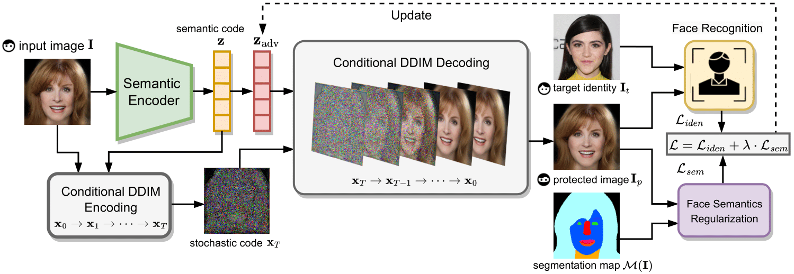

# DiffProtect: Generate Adversarial Examples with Diffusion Models for Facial Privacy Protection
Welcome to the official repository for the method presented in [DiffProtect: Generate Adversarial Examples with Diffusion Models for Facial Privacy Protection](https://arxiv.org/abs/2305.13625) 
by [Jiang Liu*](https://joellliu.github.io/), [Chun Pong Lau*](https://samuel930930.github.io/), and [Rama Chellappa](https://engineering.jhu.edu/ece/faculty/rama-chellappa/).

## Updates
**Aug 1<sup>th</sup>, 2023** Preview code release. 

## Setting Up
### Install dependency
```shell
pip install -r requirements.txt
```
### Prepare model checkpoints
1. Download [DiffAE](https://github.com/phizaz/diffae/tree/master) checkpoint [ffhq256_autoenc](https://vistec-my.sharepoint.com/:f:/g/personal/nattanatc_pro_vistec_ac_th/Ev2D_RNV2llIvm2yXyKgUxAB6w8ffg0C9NWSOtFqPMYQuw?e=f2kWUa) to `./checkpoints`
2. Download the weights for victim models from [here](https://drive.google.com/file/d/19_Y0jR789BGciogjjoGtWNEv-5QBiCB7/view?usp=sharing) and extract to `./assets`

## Run the code
```shell
python demo.py
```

## Citation 
Please cite our paper if you find this codebase helpful :)

```
@article{liu2023diffprotect,
  title={DiffProtect: Generate Adversarial Examples with Diffusion Models for Facial Privacy Protection},
  author={Liu, Jiang and Lau, Chun Pong and Chellappa, Rama},
  journal={arXiv preprint arXiv:2305.13625},
  year={2023}
}
```
